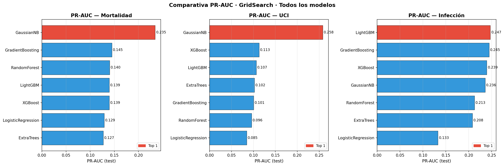
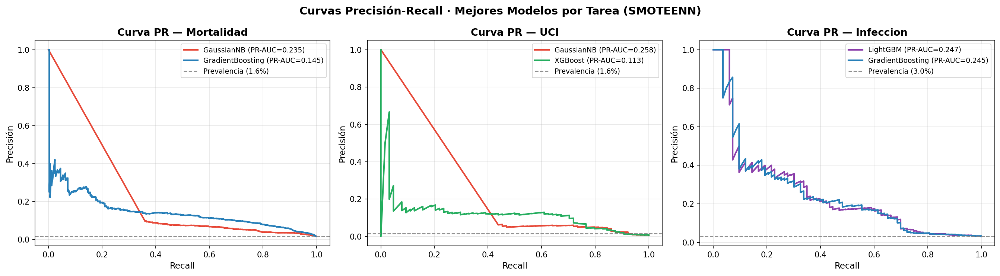
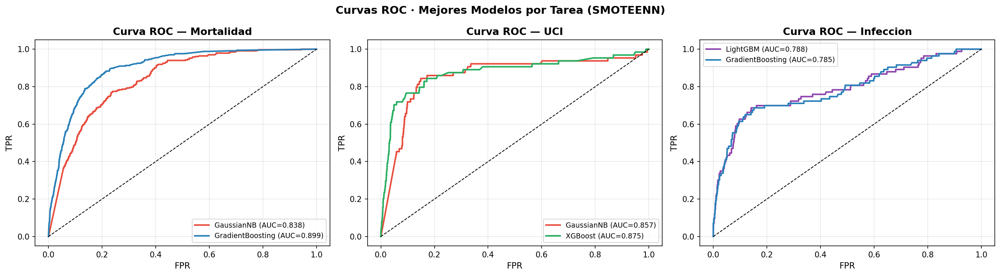
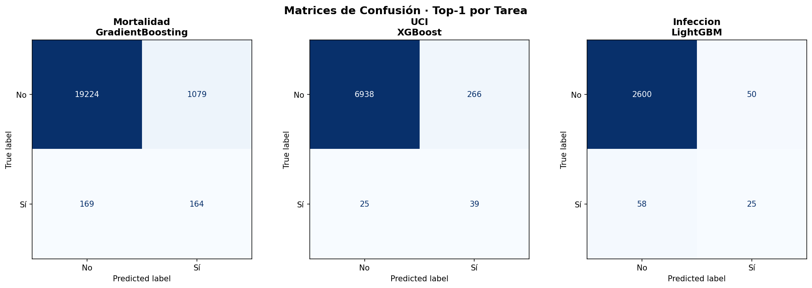
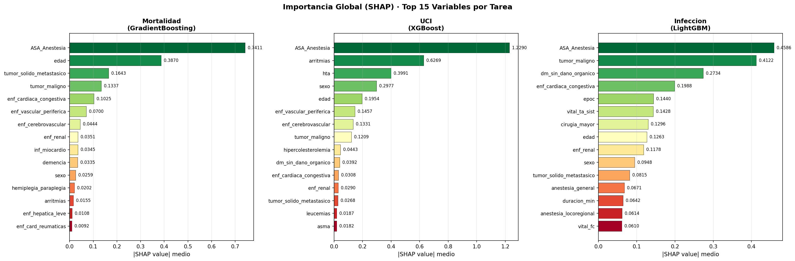
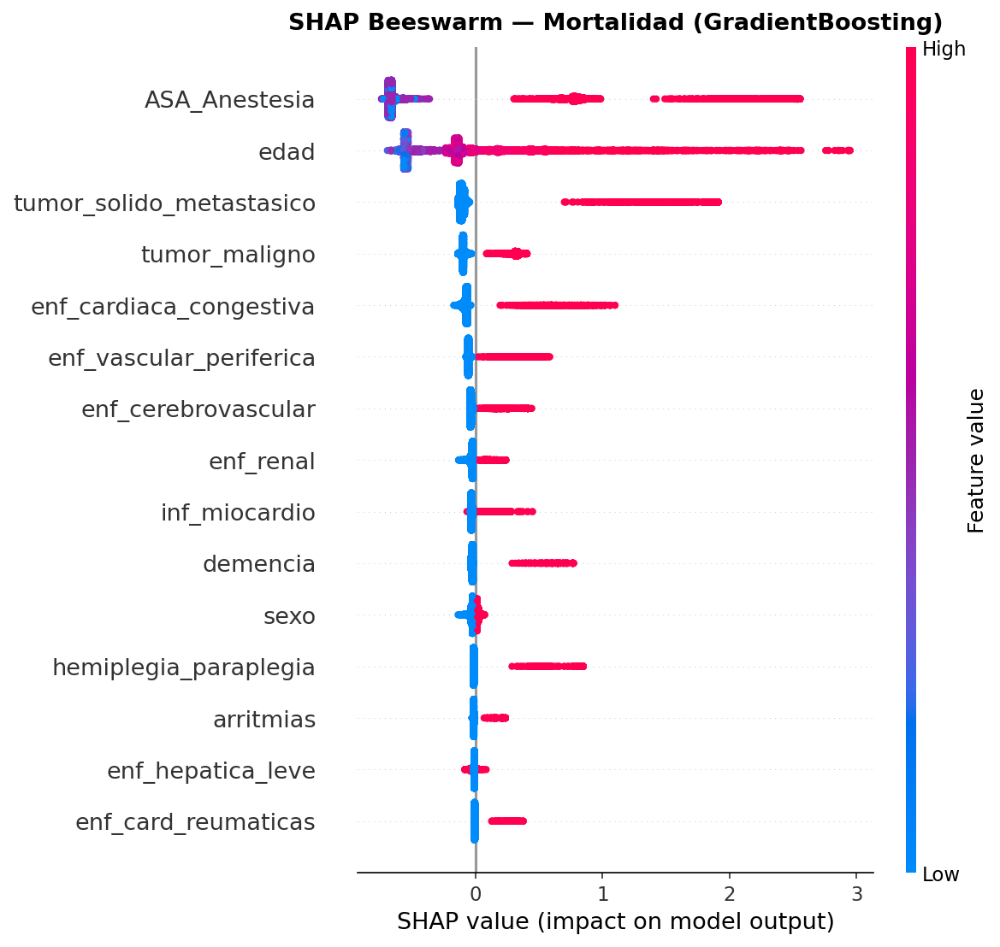
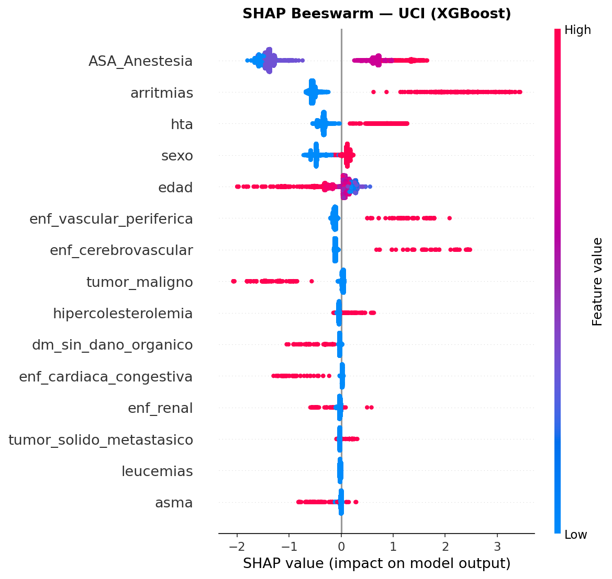
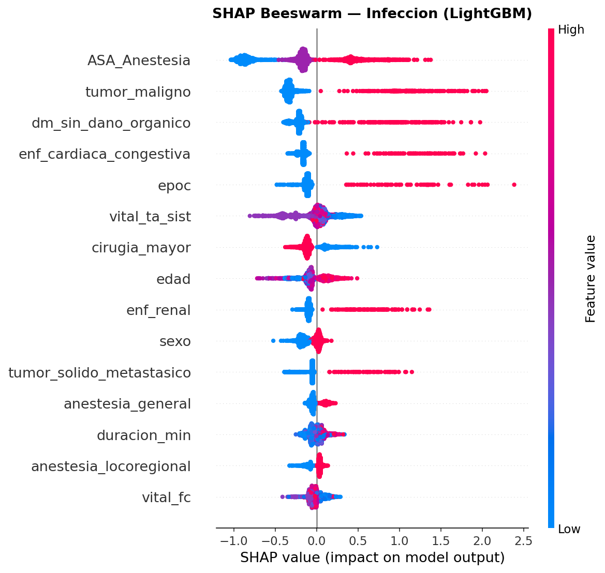

# Informe de Progreso — Predicción de Complicaciones Postquirúrgicas
**Fecha:** Abril 2026

---

## 1. Resumen

En este informe presentamos el estado actual del desarrollo de modelos de Machine Learning (ML) para la predicción de tres complicaciones postquirúrgicas:

| Tarea | Dataset | Eventos | Prevalencia | Nota |
|---|---|---|---|---|
| Mortalidad a 30 días | 103,179 episodios · 90,825 pacientes únicos | 1,665 | 1.61% | Dataset completo |
| Ingreso no planificado en UCI | 36,338 episodios · 27,125 pacientes únicos | 318 | 0.88% | Solo episodios con etiqueta UCI confirmada\* |
| Infección postoperatoria | 13,662 pacientes (Población Diana) | 413 | 3.02% | Criterios de inclusión quirúrgica |

> \* El campo UCI del dataset original presenta ~65% de valores nulos. Como no podemos determinar si un nulo significa "no ingresó en UCI" o "dato no registrado", excluimos los registros sin etiqueta para evitar ruido sistemático. Solo utilizamos los 36,338 episodios con etiqueta confirmada.

Para cada tarea hemos entrenado, validado y optimizado una batería de 7 algoritmos de ML, con especial atención al manejo del desbalanceo severo de clases y a la interpretabilidad de los modelos mediante SHAP.

---

## 2. Datos y preprocesamiento

### 2.1 Fuente de datos

- **Dataset principal:** `todo_ASA_anonimizada.xlsx` — 103,179 registros quirúrgicos, 90,825 pacientes únicos.
- **Dataset enriquecido (infección):** lo generamos en la fase de ingeniería de features para la predicción de infección, combinando el Excel original con registros de constantes vitales, datos quirúrgicos y solicitudes preoperatorias.

### 2.2 Variables utilizadas

**Para mortalidad e UCI (dataset completo):**
- Variables demográficas: sexo, edad
- 17 comorbilidades Charlson estándar: infarto de miocardio, insuficiencia cardíaca congestiva, enfermedad vascular periférica, enfermedad cerebrovascular, demencia, EPOC, enfermedad reumática, úlcera péptica, enfermedad hepática leve/moderada/severa, diabetes con/sin daño orgánico, hemiplejia/paraplejia, enfermedad renal, tumor maligno, tumor sólido metastásico, VIH
- 12 comorbilidades adicionales: arritmias, miocardiopatía, asma, linfomas, leucemias, enfisema, HTA, hipercolesterolemia, obesidad, entre otras
- Clasificación ASA de riesgo anestésico (ordinal 1–4)

**Para infección (dataset enriquecido, 43 features):**
- Todas las anteriores (33 features del Excel)
- 10 features quirúrgicas/vitales adicionales: duración de la intervención, carácter urgente, cirugía mayor, tipo de anestesia (general/locorregional), frecuencia cardíaca preoperatoria, tensión arterial sistólica y diastólica, ingreso urgente, suspensión de fármacos

### 2.3 Manejo del desbalanceo de clases

La prevalencia de complicaciones es extremadamente baja (1.6–3.0%), lo que provoca que los modelos estándar aprendan a predecir "sin complicación" para todos los pacientes. Para corregir esto, evaluamos **8 técnicas de rebalanceo**:

| Técnica | Estrategia |
|---|---|
| **SMOTE** | Oversampling sintético por interpolación k-NN |
| **Borderline-SMOTE** | SMOTE focalizado en muestras cercanas a la frontera |
| **SVM-SMOTE** | Generación sintética en regiones de soporte vectorial |
| **ADASYN** | Oversampling adaptativo según densidad local |
| **SMOTETomek** | SMOTE + limpieza con Tomek Links |
| **SMOTEENN** | SMOTE + limpieza con Edited Nearest Neighbours |
| **RandomOverSampler** | Duplicación aleatoria de la clase minoritaria |
| **RandomUnderSampler** | Eliminación aleatoria de la clase mayoritaria |

**Ganadora: SMOTEENN** — obtiene la mayor PR-AUC media en validación cruzada para ambas tareas (mortalidad y UCI), por lo que es la técnica que utilizamos en el modelado final.

---

## 3. Modelos evaluados

Entrenamos y comparamos **7 algoritmos** para cada tarea:

| Modelo | Tipo |
|---|---|
| Logistic Regression | Lineal |
| Gaussian Naïve Bayes | Probabilístico |
| Random Forest | Ensemble (bagging) |
| Extra Trees | Ensemble (bagging aleatorio) |
| Gradient Boosting | Ensemble (boosting) |
| XGBoost | Ensemble (boosting optimizado) |
| LightGBM | Ensemble (boosting eficiente) |

**Protocolo de evaluación:**
1. **Baseline:** parámetros por defecto, evaluación en test hold-out (20%)
2. **K-Fold CV (5 folds):** sobre el 80% de train, con StratifiedKFold o StratifiedGroupKFold según la tarea
3. **GridSearchCV:** optimización de hiperparámetros con `scoring='average_precision'` (PR-AUC)

**Métrica principal: PR-AUC** (Area Under the Precision-Recall Curve), que es preferible sobre AUC-ROC en contextos de alta asimetría de clases, ya que penaliza más los falsos positivos y no se infla artificialmente por la masa de negativos correctamente clasificados.

---

## 4. Resultados

### 4.1 Comparativa PR-AUC — todos los modelos

### 4.2 Modelos finales seleccionados

Para cada tarea seleccionamos los dos mejores modelos de algoritmos distintos, ordenados por PR-AUC en GridSearch:

#### Mortalidad a 30 días

| Rank | Modelo | PR-AUC | AUC-ROC | Recall | Precisión | F1 | Especificidad |
|---|---|---|---|---|---|---|---|
| **Top 1** | **GaussianNB** | **0.2346** | 0.8377 | 0.6697 | 0.0600 | 0.1102 | 0.8280 |
| **Top 2** | **GradientBoosting** | **0.1449** | 0.8990 | 0.4925 | 0.1319 | 0.2081 | 0.9469 |

*Parámetros óptimos GradientBoosting: `learning_rate=0.05, max_depth=3, n_estimators=100, subsample=0.8`*

> **Nota:** GaussianNB maximiza la sensibilidad (detecta el 67% de muertes) a costa de muchos falsos positivos. GradientBoosting ofrece mejor balance precisión/recall con mucha mayor especificidad (94.7%), siendo más útil en un contexto de recursos limitados para seguimiento.

#### Ingreso no planificado en UCI

| Rank | Modelo | PR-AUC | AUC-ROC | Recall | Precisión | F1 | Especificidad |
|---|---|---|---|---|---|---|---|
| **Top 1** | **GaussianNB** | **0.2580** | 0.8569 | 0.7344 | 0.0514 | 0.0961 | 0.8797 |
| **Top 2** | **XGBoost** | **0.1131** | 0.8747 | 0.6094 | 0.1279 | 0.2114 | 0.9631 |

*Parámetros óptimos XGBoost: `learning_rate=0.05, max_depth=3, n_estimators=200, subsample=0.8, colsample_bytree=1.0`*

> **Nota:** XGBoost ofrece mayor precisión (12.8% vs 5.1%) y especificidad (96.3%) que GaussianNB, siendo más adecuado.

#### Infección postoperatoria

| Rank | Modelo | PR-AUC | AUC-ROC | Recall | Precisión | F1 | Especificidad |
|---|---|---|---|---|---|---|---|
| **Top 1** | **LightGBM** | **0.2472** | 0.7881 | 0.3012 | 0.3333 | 0.3165 | 0.9811 |
| **Top 2** | **GradientBoosting** | **0.2446** | 0.7851 | 0.3253 | 0.3000 | 0.3121 | 0.9762 |

*Parámetros óptimos LightGBM: `learning_rate=0.05, max_depth=5, n_estimators=100, num_leaves=63`*

> **Nota:** Infección tiene la mejor precisión de las tres tareas (~33%), lo que significa que 1 de cada 3 pacientes identificados como de riesgo realmente desarrollará infección. LightGBM y GradientBoosting son casi equivalentes; LightGBM es ligeramente más conservador (menos falsas alarmas).

### 4.3 Curvas Precisión-Recall

La línea discontinua horizontal representa la prevalencia real de cada complicación. Consideramos útil un modelo que supera sistemáticamente esa línea a lo largo de todos los umbrales de decisión.

### 4.4 Curvas ROC

### 4.5 Matrices de confusión (Top-1 por tarea, umbral=0.50)

| Tarea | Modelo | TP | FP | TN | FN | Recall | Especificidad |
|---|---|---|---|---|---|---|---|
| Mortalidad | GradientBoosting | 164 | 1,079 | 19,224 | 169 | 49.3% | 94.7% |
| UCI | XGBoost | 39 | 266 | 6,938 | 25 | 60.9% | 96.3% |
| Infección | LightGBM | 25 | 50 | 2,600 | 58 | 30.1% | 98.1% |

### 4.6 Estabilidad en validación cruzada (PR-AUC por fold)

Los siguientes valores muestran la PR-AUC en cada uno de los 5 folds de validación cruzada para los modelos seleccionados:

**Mortalidad — GradientBoosting:**

| Fold 1 | Fold 2 | Fold 3 | Fold 4 | Fold 5 | Media | Std |
|---|---|---|---|---|---|---|
| 0.1134 | 0.1056 | 0.1264 | 0.1149 | 0.1085 | 0.1137 | ±0.0071 |

**Infección — LightGBM:**

| Fold 1 | Fold 2 | Fold 3 | Fold 4 | Fold 5 | Media | Std |
|---|---|---|---|---|---|---|
| 0.2361 | 0.1879 | 0.3126 | 0.3181 | 0.2007 | 0.2511 | ±0.0548 |

La mayor variabilidad en infección se debe al menor tamaño de la clase positiva (~66 positivos por fold): pequeñas fluctuaciones en el número de verdaderos positivos tienen un impacto proporcionalmente mayor en la PR-AUC.

---

## 5. Interpretabilidad — Análisis SHAP

Utilizamos SHAP (SHapley Additive exPlanations) para descomponer cada predicción individual en la contribución de cada variable, obteniendo tanto una visión global (qué variables son más importantes en promedio) como local (por qué el modelo clasifica a un paciente concreto como de alto riesgo).

### 5.1 Importancia global (|SHAP| medio)

### 5.2 SHAP Beeswarm — Mortalidad (GradientBoosting)

*Cada punto es un paciente del test set. El color indica el valor de la variable (rojo = alto, azul = bajo). La posición horizontal muestra el impacto en la predicción (positivo = aumenta el riesgo predicho).*

### 5.3 SHAP Beeswarm — UCI (XGBoost)

### 5.4 SHAP Beeswarm — Infección (LightGBM)

### 5.5 Interpretación clínica de los resultados SHAP

A continuación describimos los hallazgos más relevantes tarea por tarea, derivados directamente de los valores SHAP del modelo seleccionado.

**Mortalidad a 30 días (GradientBoosting):**
- **ASA_Anestesia** es con diferencia la variable más importante (SHAP medio = 0.741), y su dirección es coherente: mayor puntuación ASA implica mayor riesgo predicho. Esto valida la coherencia clínica del modelo, ya que ASA es el estándar de referencia en la práctica para la evaluación de riesgo anestésico.
- **Edad** ocupa el segundo lugar (0.387): a mayor edad, mayor riesgo de muerte postoperatoria, un patrón ampliamente documentado en la literatura.
- Las **comorbilidades oncológicas** —tumor sólido metastásico (0.164) y tumor maligno (0.134)— ocupan el tercer y cuarto lugar, lo que es esperable dado que los pacientes con cáncer avanzado presentan mayor fragilidad.
- Las **comorbilidades cardiovasculares** —insuficiencia cardíaca congestiva (0.103), enfermedad vascular periférica (0.070), enfermedad cerebrovascular (0.044) e infarto de miocardio (0.034)— completan el top 10, todas ellas aumentando el riesgo predicho. Destaca también la **demencia** (0.034), cuyo impacto refleja la mayor vulnerabilidad de los pacientes con deterioro cognitivo.

**Ingreso no planificado en UCI (XGBoost):**
- **ASA_Anestesia** vuelve a ser el predictor dominante (1.229), con un efecto considerablemente mayor que en mortalidad, lo que sugiere que la necesidad de UCI urgente está fuertemente determinada por el estado preoperatorio global del paciente.
- **Arritmias** aparece en segunda posición (0.627): los pacientes con antecedentes de arritmia presentan mayor riesgo de ingreso no planificado en UCI.
- **HTA** (0.399) y **enfermedad vascular periférica** (0.145) también contribuyen positivamente al riesgo, reforzando el perfil cardiovascular como factor clave en la predicción de UCI.
- **Sexo** ocupa el cuarto lugar (0.298): el modelo detecta diferencias de riesgo entre sexos.

**Infección postoperatoria (LightGBM):**
- **ASA_Anestesia** es de nuevo el predictor principal (0.459), coherente con la relación entre el estado preoperatorio y la capacidad del paciente para resistir complicaciones infecciosas.
- **Tumor maligno** aparece en segunda posición (0.412), lo que es clínicamente relevante: los pacientes oncológicos presentan mayor susceptibilidad a infecciones postoperatorias.
- **Diabetes sin daño orgánico** (0.273) es el tercer factor, en línea con la evidencia establecida que señala la diabetes como uno de los principales factores de riesgo para infección de sitio quirúrgico.
- **Insuficiencia cardíaca congestiva** (0.199) y **EPOC** (0.144) también contribuyen positivamente al riesgo infeccioso.
- **Tensión arterial sistólica preoperatoria** (0.143) presenta dirección negativa: valores más bajos de TA sistólica se asocian a mayor riesgo de infección.

---

## 6. Calibración de probabilidades

Los modelos con SMOTEENN tienden a sobreestimar las probabilidades de riesgo, ya que durante el entrenamiento el balanceo artificial eleva la prevalencia al ~30%, cuando la real es del 1.6–3%. Aplicamos recalibración isotónica sobre el 50% del test set, obteniendo mejoras en el Brier Score en todos los modelos evaluados.

---

## 7. Resumen comparativo entre tareas

| Tarea | Prevalencia | Mejor modelo | PR-AUC | AUC-ROC | Recall | Precisión |
|---|---|---|---|---|---|---|
| Mortalidad | 1.6% | GradientBoosting | 0.1449 | 0.8990 | 49.3% | 13.2% |
| UCI | 0.9% | XGBoost | 0.1131 | 0.8747 | 60.9% | 12.8% |
| **Infección** | **3.0%** | **LightGBM** | **0.2472** | **0.7881** | **30.1%** | **33.3%** |

La infección postoperatoria es la tarea con **mejor precisión** (1 de cada 3 alertas son verdadero positivo) y segunda mejor PR-AUC, a pesar de restringirnos a la Población Diana de 13,662 pacientes. Esto es coherente con su mayor prevalencia relativa y con el enriquecimiento de features quirúrgicas y vitales disponibles en ese subconjunto.

